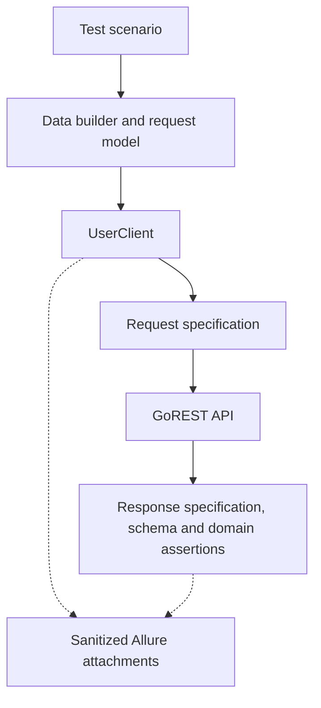

# REST Assured API Automation Framework

[](https://github.com/RPravin86/rest-assured-api-automation-framework/actions/workflows/api-tests.yml)
[](https://openjdk.org/projects/jdk/17/)
[](https://rest-assured.io/)
[](https://testng.org/)
[](https://allurereport.org/)
[](LICENSE)

A production-style API test automation framework for the [GoREST Users API](https://gorest.co.in/), built with Java 17, REST Assured, TestNG, Maven, Jackson, Lombok, AssertJ, Log4j2 and Allure Report.

The project demonstrates maintainable API-client design, authenticated and public requests, schema and domain validation, parallel-safe test data, infrastructure-only retries, secure reporting, and automated execution through GitHub Actions and Jenkins.

## Highlights

- Complete user lifecycle coverage: `POST`, `GET`, `PUT`, `PATCH` and `DELETE`
- Public collection testing for filtering and pagination
- Positive, negative, authentication and end-to-end scenarios
- Request and response POJOs with Jackson and targeted Lombok annotations
- Reusable request specifications, response specifications and endpoint clients
- JSON Schema validation plus fluent AssertJ domain assertions
- UUID-based test data and automatic per-test cleanup
- Sequential and parallel TestNG suites with named execution groups
- Retries limited to safe, read-only tests and transient infrastructure failures
- Allure steps, HTTP attachments, environment metadata and failure categories
- Bearer-token masking in report attachments and REST Assured logging
- GitHub Actions and parameterized Jenkins pipelines

## Verified execution

| Suite | Tests | Passed | Failed | Skipped |
|---|---:|---:|---:|---:|
| Complete sequential suite | 55 | 55 | 0 | 0 |
| Parallel API suite | 17 | 17 | 0 | 0 |

See [verified execution results](docs/execution-results.md) for the Maven and CI evidence represented by these figures.

## Architecture



Tests express business scenarios while framework components own transport configuration, authentication, serialization, reporting and reusable validation. See the [architecture guide](docs/architecture.md) for responsibilities and design decisions.

## Technology stack

| Area | Technology |
|---|---|
| Language | Java 17 |
| Build | Maven |
| API automation | REST Assured 6 |
| Test runner | TestNG |
| Serialization | Jackson |
| Model boilerplate | Lombok |
| Assertions | REST Assured and AssertJ |
| Contract validation | REST Assured JSON Schema Validator |
| Reporting | Allure Report |
| Logging | Log4j2 |
| CI/CD | GitHub Actions and Jenkins |

## Project structure

```text
src/main/java/io/github/rpravin86/api/
├── client/          Endpoint-specific REST operations
├── config/          Environment and secret resolution
├── constants/       Routes and framework constants
├── filter/          Sanitized Allure HTTP attachments
├── model/           Request, response and enum contracts
└── specification/   Shared request and response specifications

src/test/java/io/github/rpravin86/api/
├── assertion/       Domain-specific assertions
├── base/            Parallel-safe lifecycle and cleanup
├── builder/         Unique test-data builders
├── dataprovider/    Negative-test datasets
├── listener/        Allure metadata and execution logging
├── retry/           Opt-in infrastructure retry handling
├── schema/          Schema contract tests
└── tests/user/      GoREST user scenarios

src/test/resources/
├── config/          Environment properties
├── schemas/         JSON response schemas
├── testng.xml       Complete sequential suite
└── testng-parallel.xml
```

## Test coverage

| Capability | Coverage |
|---|---|
| Create user | Successful authenticated creation |
| Retrieve user | Authenticated retrieval and public collection retrieval |
| Update user | Complete `PUT` and partial `PATCH` |
| Delete user | Deletion and post-deletion validation |
| Query collection | Status filtering, page selection and page size |
| Authentication | Missing-token rejection |
| Validation | Duplicate email and invalid request payloads |
| Error handling | Nonexistent resources and structured API errors |
| Contract testing | Single-user, collection and error JSON schemas |
| Workflow | Complete create-to-delete user lifecycle |

## Prerequisites

- Java 17
- Maven 3.9 or later
- Git
- A [GoREST access token](https://gorest.co.in/my-account/access-tokens) for authenticated operations
- Allure command-line tool only when opening reports locally

Verify the local tools:

```bash
java -version
mvn -version
git --version
```

## Getting started

Clone the repository:

```bash
git clone https://github.com/RPravin86/rest-assured-api-automation-framework.git
cd rest-assured-api-automation-framework
```

Set the GoREST token as an environment variable. Never place the real token in a project file.

macOS or Linux:

```bash
export GOREST_API_TOKEN="your-token"
```

PowerShell:

```powershell
$Env:GOREST_API_TOKEN = "your-token"
```

Run the complete suite:

```bash
mvn clean test
```

## Execution options

| Goal | Command |
|---|---|
| Complete sequential suite | `mvn clean test` |
| Parallel API suite | `mvn clean test -Dtest.suite=src/test/resources/testng-parallel.xml` |
| Smoke tests | `mvn clean test -Dgroups=smoke` |
| Regression tests | `mvn clean test -Dgroups=regression` |
| Negative tests | `mvn clean test -Dgroups=negative` |
| End-to-end workflow | `mvn clean test -Dgroups=e2e` |
| Development environment | `mvn clean test -Dtest.environment=dev` |
| Debug logging | `mvn clean test -Dlog.level=debug` |
| Disable retries | `mvn clean test -Dretry.max.attempts=0` |

Environment selection uses this precedence:

1. `-Dtest.environment=<name>` system property
2. `TEST_ENVIRONMENT` environment variable
3. `qa` default

Token resolution uses `-Dgorest.api.token=<token>` first and `GOREST_API_TOKEN` second. Prefer the environment variable because command-line values may remain in shell history.

## Reporting and logs

Raw Allure results are generated under:

```text
target/allure-results/
```

Install the Allure CLI with one of these options:

```bash
brew install allure
```

```bash
npm install --global allure-commandline@2.35.1
```

Generate and open the report:

```bash
allure serve target/allure-results
```

Framework logs are written to:

```text
target/logs/api-automation.log
```

Allure attachments redact authorization, API-key and cookie headers without modifying the request delivered to GoREST.

## CI/CD

### GitHub Actions

The `GoREST API Tests` workflow runs for pull requests to `main`, pushes to `main`, and manual executions. Manual runs allow environment, suite and group selection.

Configure this repository secret before executing the workflow:

```text
GOREST_API_TOKEN
```

Successful runs publish an Allure HTML report and a diagnostic artifact containing raw Allure results, Surefire reports and Log4j2 logs.

### Jenkins

The declarative `Jenkinsfile` exposes parameters for environment, suite, group and logging level. Jenkins requires:

- JDK tool named `jdk17`
- Maven tool named `maven3`
- Secret-text credential named `gorest-api-token`
- Pipeline, Credentials Binding, JUnit, Allure Jenkins and Timestamper plugins

## Reliability and security

- Every test owns the users it creates and cleans them up in an `alwaysRun` fixture.
- Created IDs are stored in `ThreadLocal` collections for parallel safety.
- Only explicitly annotated public GET tests can retry.
- Retry classification is limited to transport failures and HTTP `429`, `502`, `503` and `504` responses.
- Mutating operations are never automatically retried, preventing duplicate remote data.
- Secrets are loaded at runtime and excluded from source control and Allure metadata.
- Sensitive HTTP headers are masked in diagnostic attachments.

## Troubleshooting

Common setup, token, TestNG, Allure and GoREST issues are documented in the [troubleshooting guide](docs/troubleshooting.md).

## Documentation

- [Architecture and design decisions](docs/architecture.md)
- [Verified execution results](docs/execution-results.md)
- [Troubleshooting guide](docs/troubleshooting.md)

## Author

**Pravin Ranjane** — Senior SDET / Technical QA Lead

- [GitHub](https://github.com/RPravin86)
- [LinkedIn](https://www.linkedin.com/in/pravin-ranjane)

## License

This project is available under the [MIT License](LICENSE).
