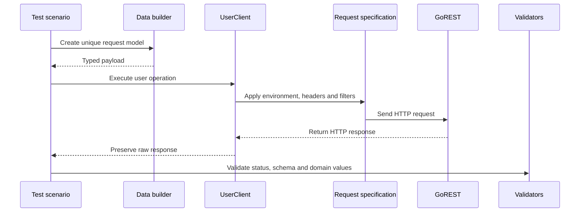

# Architecture and design decisions

## Request lifecycle

The client returns a raw REST Assured `Response`. This permits the same client operation to support successful responses, negative contracts, header validation, schema validation and typed deserialization without mixing assertions into the transport layer.

## Component responsibilities

| Component | Responsibility | Deliberately excludes |
|---|---|---|
| `ConfigManager` | Environment properties, timeouts and runtime token resolution | Hard-coded secrets |
| `RequestSpecFactory` | Base URI/path, timeouts, content type, authentication and filters | Endpoint-specific data |
| `ResponseSpecFactory` | Reusable HTTP status and content-type expectations | User-domain assertions |
| `SensitiveDataFilter` | Sanitized Allure request and response attachments | Modification of the real API request |
| `UserClient` | User endpoint routes and HTTP methods | Test assertions |
| Request models | API payload contracts | Random-data generation |
| Response models | Typed success and error contracts | Transport configuration |
| `UserDataBuilder` | Unique valid data with targeted overrides | Network operations |
| `UserAssertions` | Business and domain comparisons | API calls |
| `BaseTest` | Client access and per-test cleanup | Individual scenarios |

## Public and authenticated specifications

Public GET operations use a specification without an authorization header. Authenticated create, retrieve, update, patch and delete operations use the bearer-token specification. Keeping both paths explicit demonstrates public API consumption while ensuring authenticated resources created by a test can be retrieved reliably.

## Model strategy

Request and response types are separate because API input and output contracts evolve independently. `CreateUserRequest` represents mandatory creation fields, while `UpdateUserRequest` can serialize both complete PUT payloads and partial PATCH payloads. Null update fields are omitted.

Lombok is limited to model boilerplate. Framework logic, clients, specifications and tests remain explicit.

## Validation layers

The framework validates responses at three levels:

1. HTTP contract — status code and content type through reusable response specifications.
2. JSON contract — required fields, data types and allowed values through JSON Schema.
3. Domain behavior — request/response equality and workflow state through AssertJ helpers.

This separation produces more precise failures than relying on body assertions alone.

## Test-data lifecycle

Each test creates its own uniquely identified users. A created ID is registered immediately and removed after successful explicit deletion. Remaining IDs are deleted by an `@AfterMethod(alwaysRun = true)` fixture.

Cleanup accepts both `204` and `404`: a resource that was already deleted satisfies the cleanup objective. Cleanup failures are logged without hiding the original test failure.

IDs are maintained in `ThreadLocal<Set<Long>>`, isolating cleanup state when TestNG executes methods concurrently.

## Retry policy

Retry behavior is deliberately opt-in through `@RetryOnInfrastructureFailure` and currently applies only to public, read-only GET scenarios.

Retryable conditions include connection, DNS, socket, TLS and timeout exceptions plus transient HTTP `429`, `502`, `503` and `504` responses. Assertion failures, authentication failures and mutating API operations are not retried.

This policy improves resilience without hiding product defects or duplicating remote writes.

## Reporting and observability

The Allure REST Assured filter attaches sanitized HTTP exchanges. A TestNG lifecycle listener adds environment metadata, copies failure categories and logs suite-level counts. Log4j2 writes console output and rolling files with thread names, making concurrent execution visible.

The bearer token is available to the actual REST Assured request but is excluded from Allure metadata and redacted from request attachments.

## Execution topology

The default `testng.xml` runs framework and API tests sequentially. `testng-parallel.xml` runs only integration scenarios with three method threads; this avoids parallelizing configuration unit tests that temporarily modify JVM-wide system properties.

GitHub Actions uses the same Maven entry points as local execution. Jenkins exposes the same environment, suite, group and log-level choices as build parameters.
